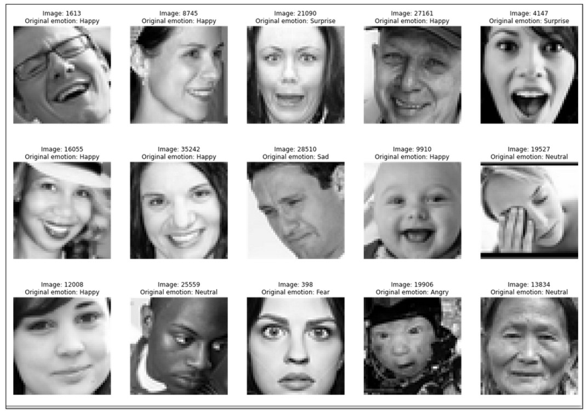
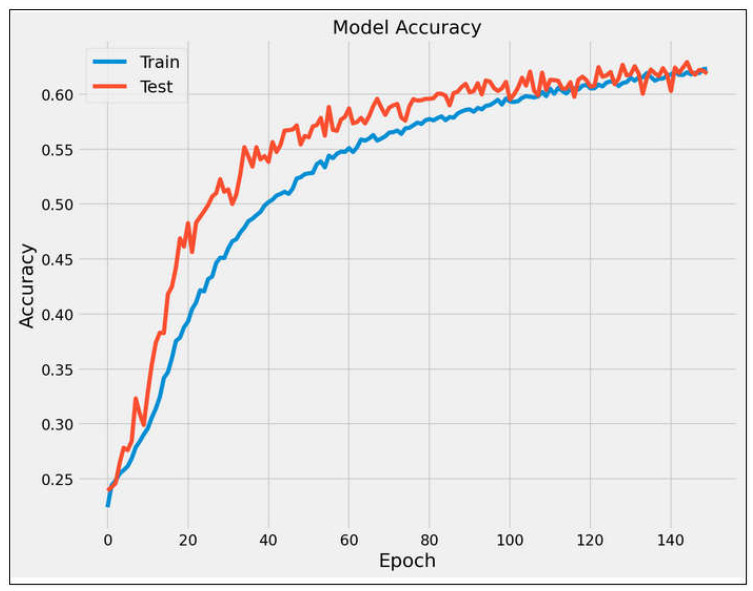
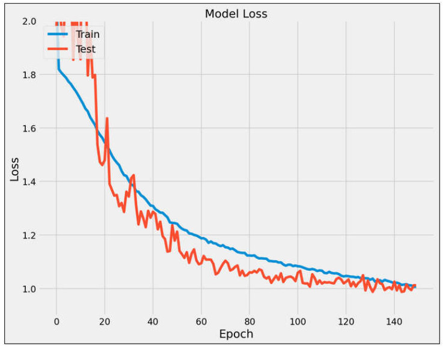
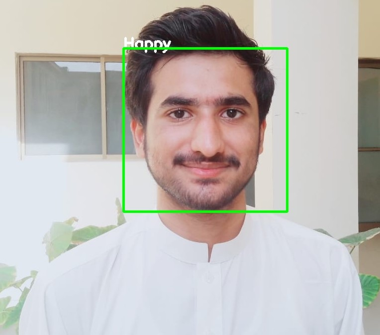
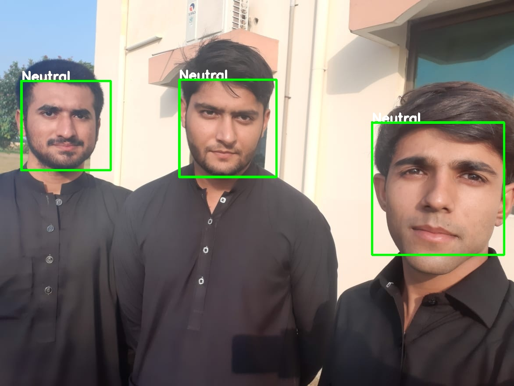
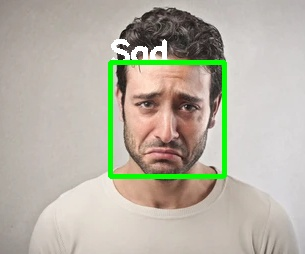
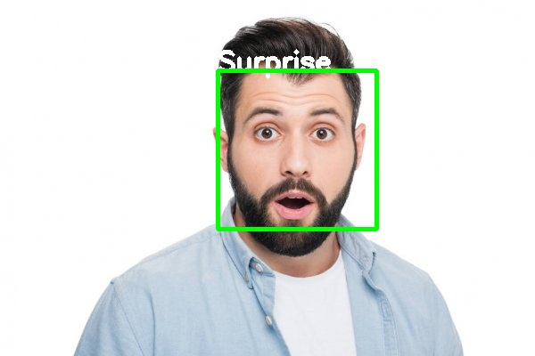

# Facial Emotion Recognition
The FER2013 dataset is provided for a competition of Kaggle. The dataset contains 35,887 face images, including 28,709 training sets, 3589 verification sets, and, 589 test sets, all of which are grayscale images of 48 pixels×48 pixels. These samples are divided into seven categories on a basically average distribution, i.e., angry, disgusting, fearful, happy, neutral, sad, and amazed. Each sample in the dataset has a large difference in age, facial direction or other aspects, which is close to the real-world situation.

  

## Results

  
 

  
 
 
 

